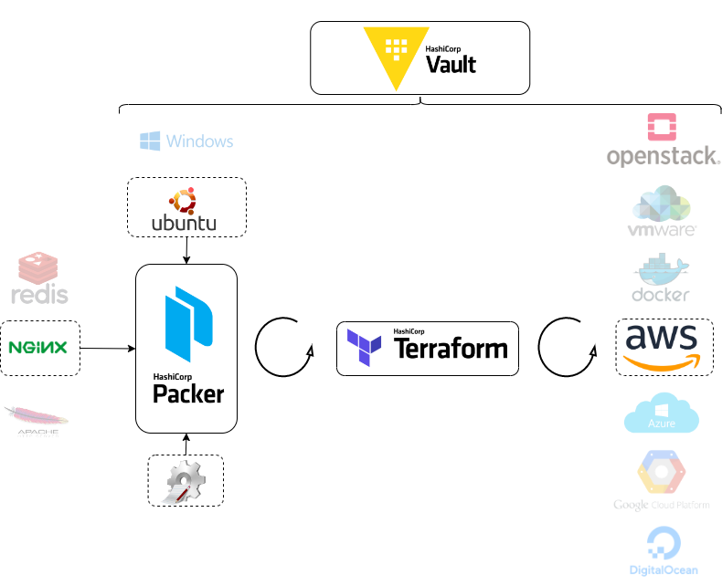

layout: true
class: title, shelf
background-image: url(../../assets/images/backgrounds/HashiCorp-Content-bkg.png)
background-size: cover
name: slide2

???
HashiCorp Packer and Terraform are both powerful tools used in the DevOps and infrastructure-as-code (IaC) domains. When integrated together in combination with Vault, they can streamline and secure the deployment process.

Packer can create machine images for multiple platforms, such as Amazon Web Services (AWS), Microsoft Azure, and VMware. Packer builds the image from JSON or HCL (HashiCorp Configuration Language) configuration files. This can include installing software, configuring settings, and performing other customizations.

Terraform can use images created by Packer to manage infrastructure resources across various cloud providers and services. It uses a declarative language to describe the desired infrastructure state, provisioning and managing resources like virtual machines, networks, and storage.

Vault is a secure and flexible tool for secrets management that enhances security, simplifies operations, and protects valuable data effectively. Offering centralized storage, strict access controls, and comprehensive audit trails for sensitive information. With dynamic secret generation and rotation, strong encryption, and seamless integration capabilities.

The next example will show a simple integration using Vault to manage credentails across both applications. Packer will create an Amazon Machine Image (AMI) with Nginx installed, that Terraform can use to provision an Amazon Elastic Compute Cloud (EC2) instance.

---
